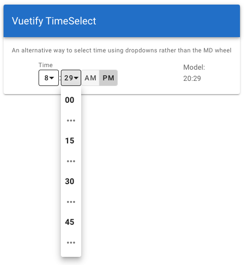

# vuetify-time-select

[](https://www.npmjs.com/package/vuetify-time-select)
[](https://www.npmjs.com/package/vuetify-time-select)
[](https://github.com/fontzter/vuetify-time-select/blob/master/LICENSE)

An alternative time-picker using dropdowns instead of the MD time "wheel".

**Requires [Vuetify](https://vuetifyjs.com/)** - built using Vuetify Components

While [Vuetify's TimePicker](https://vuetifyjs.com/en/components/time-pickers) is an excellent component and conforms to the Material Design Specs, some users may find it confusing or cumbersome (especially on a desktop app). This component is provided as an alternative that still conforms to (other) MD specs and works within the Vuetify ecosystem. 

See a working example here: https://codepen.io/fontzter/pen/GRRMqNa



## Installation

From the root of a Vue project **already using Vuetify**:

```sh
npm i -S vuetify-time-select
```

Or if using yarn

```sh
yarn add vuetify-time-select
```

If you want the component to be registered and available globally, from your main Vue configuration file (frequently `src/main.js`), add the following **before** instantiating Vue for the first time:

```js
import Vue from 'vue'
import VuetifyTimeSelect from 'vuetify-time-select'

Vue.component('vuetify-time-select', VuetifyTimeSelect)
```

Or if you just want to use the `vuetify-time-select` component within another component:

```vue
<script>
  import { VuetifyTimeSelect } from 'vuetify-time-select'
  export default {
    components: {
      VuetifyTimeSelect
    },
    /* ... the rest of your code ... */
  }
</script>
```

## Basic Usage

```vue
<template>
  <vuetify-time-select v-model="time"></vuetify-time-select>
</template>

<script>
  // the import statement and components section is unnecessary
  // if the component was registered globally (see above)
  import { VuetifyTimeSelect } from 'vuetify-time-select'

  export default {
    components: {
      VuetifyTimeSelect
    },
    data: () => ({
      time: '20:30' // specified in HH:MM format
    })
    /* ... the rest of your code ... */
  }
</script>
```

## Props
|         Name         |    Type    | Default | Required? | Description                                                                                                                                                       |
|:--------------------:|:----------:|:-------:|:---------:|-------------------------------------------------------------------------------------------------------------------------------------------------------------------|
|     `color`    |  `string`  |  `null` |     no    | Apply a color to the Time Select (simply extends Vuetify's color prop)             |
|     `label`    |  `string`  |  `null` |     no    | Label that appears above the time select                                              |
|   `minuteGroups`   |  `array` | `[0, 15, 30, 45]` |     no    |  The minutes that will always show in the dropdown. (An elipsis will be added to access minutes between them)                                            |
|        `value`        |  `string`  |  `null` |    yes     | the time value used by the time select (expects and returns `HH:MM` in 24hr format)                                                                                  |

## Questions, Comments, Bug Reports, etc.

Comments, questions, pull requests, and bug reports are very welcome. Please [submit an issue via the Issues tab](https://github.com/fontzter/vuetify-time-select/issues) above.
